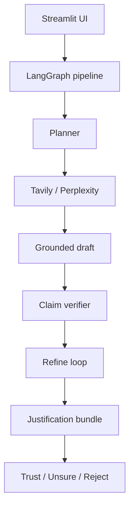

# NL ChatGPT

Agentic RAG prototype: verified, justifiable answers with citations and human-in-the-loop judgment (Product Manager Fellowship — NextLeap).

## Docs

- [Problem statement](./problem-statement.md)
- [Architecture](./docs/ARCHITECTURE.md) — includes system diagram
- [Implementation phases](./docs/PHASES.md)
- [Prompt log](./docs/PROMPTS.md) — fellowship deliverable
- [Demo guide](./docs/DEMO.md) — 2-min script + deploy steps
- [Submission checklist](./docs/SUBMISSION.md)
- [Deck outline (10 slides)](./docs/deck/NL_CHATGPT_SLIDES.md) → export as `NL ChatGPT.pdf`
- [Failure modes](./docs/FAILURE_MODES.md)
- [User research templates](./docs/research/)

## Requirements

- Python **3.11+** (required for Streamlit Cloud; see `.python-version`)
- API keys are optional for **Phase 0** (mock retrieval and stub draft)

## Setup

```bash
cd "NL ChatGPT"
python3 -m venv .venv
source .venv/bin/activate   # Windows: .venv\Scripts\activate
pip install -e ".[dev]"
cp .env.example .env        # fill keys before Phase 1
```

## Phase 1 — Run the RAG pipeline

Requires `.env` with API keys for full functionality:

```bash
GROQ_API_KEY=gsk_...       # Recommended — fast LLM via Groq (OpenAI-compatible API)
# OPENAI_API_KEY=sk-...    # Optional alternative
LLM_PROVIDER=auto          # auto prefers Groq if GROQ_API_KEY is set
LLM_MODEL=llama-3.3-70b-versatile   # optional; Groq default if empty
TAVILY_API_KEY=tvly-...    # Live web retrieval (recommended)
```

```bash
python -m src.agents.graph --query "What is Agentic RAG?"
python -m src.agents.graph --query "Who is the current CEO of Microsoft?" --stakes high
python -m src.agents.graph --query "Your question" --draft-only
```

Without API keys, the pipeline uses **mock sources** and template drafting (dev/CI mode).

Returns a JSON `JustificationBundle` with live or mock citations (≥3 URLs when sources exist), grounded answer, and verify checklist.

## Tests

```bash
pytest tests/ -v
```

## Project structure

```
src/
  agents/       # LangGraph pipeline
  models/       # Pydantic schemas
  prompts/      # System prompt templates
  config/       # Settings (.env)
  retrieval/    # Phase 1
  verification/ # Phase 2
app/            # Streamlit (Phase 3)
eval/           # Ragas / DeepEval (Phase 4)
tests/
docs/
```

## Environment variables

See [.env.example](./.env.example). Phase 0 runs without API keys.

| Variable | Phase |
|----------|-------|
| `GROQ_API_KEY` | 1+ (recommended) |
| `OPENAI_API_KEY` | 1+ (alternative) |
| `LLM_PROVIDER` | auto / groq / openai |
| `LLM_MODEL` | optional override |
| `TAVILY_API_KEY` | 1+ |
| `CONFIDENCE_THRESHOLD_HIGH` | 0+ |
| `MAX_REFINE_ITERATIONS` | 2+ |

## Phase 2 — Verify / refine loop

Default pipeline includes self-verification and up to `MAX_REFINE_ITERATIONS` refine passes:

```bash
python -m src.agents.graph --query "What is Agentic RAG?"
python -m src.agents.graph --query "Your question" --no-verify   # Phase 1 only
```

Output phase: `2-verified` with per-claim verdicts (supported / partial / unsupported / contradicted).

## Phase 3 — Streamlit UI

```bash
streamlit run app/streamlit_app.py
```

Features:
- Chat history with **streaming answers**
- **Justification panel**: sources, color-coded claims, assumptions, gaps, verify checklist
- Optional **verification plan** toggle (sidebar)
- **Review before using** banner when overall confidence is low
- API status for LLM / retrieval keys

### Optional FastAPI + SSE

```bash
uvicorn src.api.main:app --reload --port 8000
# GET /health
# POST /chat  — full JSON response
# GET /chat/stream?query=...&stakes=medium  — SSE events
```

### Deploy on Streamlit Cloud

1. Push repo to GitHub (include `.python-version`, `requirements.txt`, `pyproject.toml`).
2. [share.streamlit.io](https://share.streamlit.io) → main file: `app/streamlit_app.py`.
3. Set **Python 3.11** in Advanced settings (must match `.python-version`).
4. Add **Secrets**: `GROQ_API_KEY`, `TAVILY_API_KEY`, `LLM_PROVIDER=groq`, `USE_MOCK_WHEN_NO_KEYS=false`.

See [docs/DEMO.md](./docs/DEMO.md) for the full deploy checklist.

## Phase 4 — Evaluation

```bash
make eval-quick          # 5 items, internal metrics only (fast)
make eval                # full dataset (25 items) + optional Ragas/DeepEval
pip install -e ".[eval]" # install ragas + deepeval
```

Outputs in `eval/results/`:
- `summary.md` / `summary.json` — deck-ready metrics
- `calibration.json` — confidence vs verdict + threshold recommendations
- `per_item.jsonl` — per-question breakdown

| Metric | Target |
|--------|--------|
| Ragas faithfulness | ≥ 0.75 |
| Unsupported claim rate (post-verify) | < 10% |
| Refine trigger rate | 15–40% |
| Heuristic faithfulness (no Ragas) | ≥ 0.75 |

Tune thresholds from `eval/results/calibration.json` → update `CONFIDENCE_THRESHOLD_HIGH` / `CONFIDENCE_THRESHOLD_MEDIUM` in `.env`.

## Phase 5 — Human judgment layer

Per-claim **Trust / Unsure / Reject** with optional notes; reviews persist to `data/judgments.db`.

| Stakes | Behavior |
|--------|----------|
| **Low** | Export not gated |
| **Medium** | Review recommended |
| **High** | ≥1 claim review + sign-off required before download |

Export includes answer, justification, your verdicts, and rejected claims.

Sidebar: **How this supports your judgment** (fellowship pillars).

## Phase 6 — Polish & submission

| Artefact | Path |
|----------|------|
| Prompt log | [docs/PROMPTS.md](./docs/PROMPTS.md) |
| 10-slide deck outline | [docs/deck/NL_CHATGPT_SLIDES.md](./docs/deck/NL_CHATGPT_SLIDES.md) |
| Demo script | [docs/DEMO.md](./docs/DEMO.md) |
| Submission checklist | [docs/SUBMISSION.md](./docs/SUBMISSION.md) |

```bash
make check-secrets    # scan for leaked API keys in tracked files
make test
make eval-quick       # deck metrics
streamlit run app/streamlit_app.py
```

**Performance:** Multiple Tavily retrieval queries run in parallel (up to 4 workers).

**Security:** `.env` is gitignored; UI footer explains data sent to LLM/retrieval providers and local judgment storage.

**Optional:** Record a demo GIF → `docs/assets/demo.gif` for deck slide 7.

## Architecture (high level)



See [docs/ARCHITECTURE.md](./docs/ARCHITECTURE.md) for full detail.
