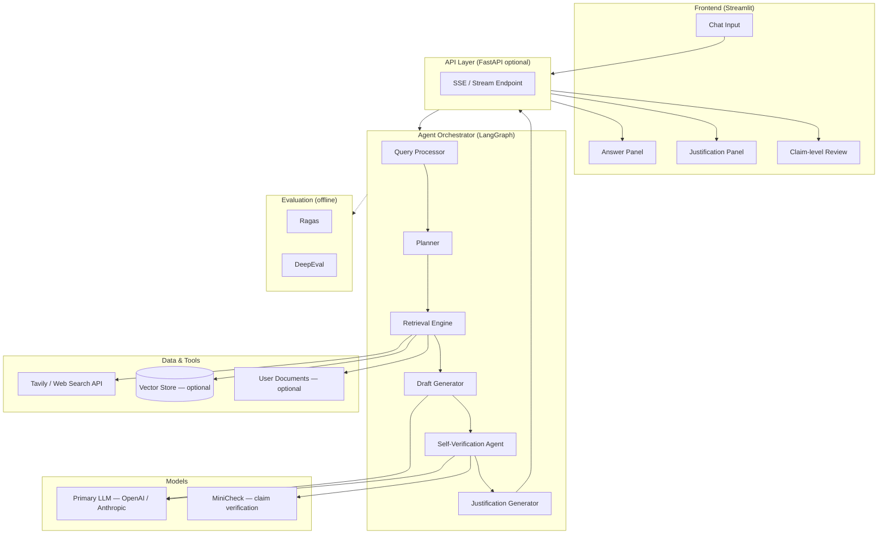
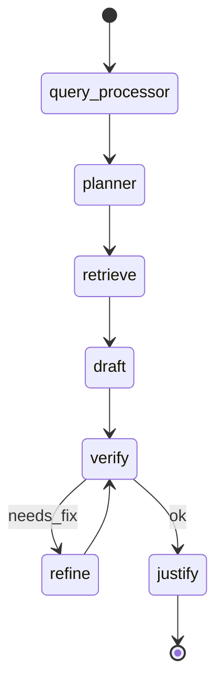

# Agentic RAG Assistant — System Architecture

**Product:** NL ChatGPT prototype — verified, justifiable answers  
**Approach:** Agentic RAG (retrieval + self-verification + citations), not LLM-only generation  
**Alignment:** Supports fellowship goal of *evaluable, legible outputs*; verification assists human judgment rather than replacing it.

---

## 1. Executive summary

This system answers user questions by:

1. **Planning** what evidence is needed  
2. **Retrieving** real-time and/or indexed sources  
3. **Drafting** an initial answer grounded in context  
4. **Verifying** claims against retrieved evidence (structured critique, optional MiniCheck)  
5. **Justifying** the final response with citations, uncertainty, and per-claim confidence  

The user receives a **chat-style answer plus a justification layer** they can inspect before acting.

---

## 2. Design principles

| Principle | Implementation |
|-----------|----------------|
| **Grounded, not guessed** | Retrieve before asserting; say "insufficient information" when evidence is weak |
| **Legible reasoning** | Expose plan, sources, assumptions, and verification steps |
| **Human judgment first** | UI shows claims + sources; user confirms/edits/rejects — no blind trust score as sole signal |
| **Avoid opaque black boxes** | Verification steps are structured JSON + human-readable summary |
| **Calibrated confidence** | Per-claim confidence (1–10) + overall band; low-confidence claims flagged, not hidden |

> **Fellowship note:** Fact-checking and citations are *enablers* of evaluation, not the whole product. Phases 4–5 add user-facing judgment workflows (review sheet, accept/reject per claim).

---

## 3. High-level architecture



---

## 4. Component specifications

### 4.1 Query Processor

**Responsibility:** Normalize and classify incoming user messages.

| Input | Output |
|-------|--------|
| Raw user text + session context | `ProcessedQuery` schema |

**Tasks:**

- Intent classification: `factual` | `analytical` | `creative` | `procedural`
- Risk/stakes hint (optional user toggle): `low` | `medium` | `high`
- Query decomposition for multi-part questions
- Rewrite for retrieval (keyword + semantic variants)

**Schema (example):**

```json
{
  "original_query": "...",
  "retrieval_queries": ["...", "..."],
  "intent": "factual",
  "stakes": "medium",
  "requires_realtime": true,
  "requires_user_docs": false
}
```

---

### 4.2 Retrieval Engine

**Responsibility:** Fetch evidence independent of the LLM’s parametric memory.

| Source | Tool | When |
|--------|------|------|
| Real-time web | Tavily AI / Perplexity API | Default for time-sensitive or unknown facts |
| Static corpus | LlamaIndex / LangChain vector retriever | User-uploaded PDFs, internal docs |
| Hybrid | Query router | Combine web + local with deduplication |

**Output:** `RetrievedContext[]` with `url`, `title`, `snippet`, `published_at`, `relevance_score`.

**Rules:**

- Top-k chunks (default k=5–8) with MMR for diversity  
- Deduplicate URLs and near-duplicate snippets  
- Store raw retrieval payload for audit trail  

---

### 4.3 Draft Generator (initial answer)

**Responsibility:** Produce a first-pass answer **only** from `ProcessedQuery` + `RetrievedContext`.

- System prompt enforces: cite source IDs inline, no unsupported claims  
- Output: `DraftAnswer` with `body` + `inline_citations[]`  

---

### 4.4 Self-Verification Agent

**Responsibility:** Compare draft claims to retrieved sources; flag unsupported or contradictory statements.

**Loop (LangGraph node):**

1. Extract atomic **claims** from draft (structured output)  
2. For each claim: `supported` | `partial` | `unsupported` | `contradicted`  
3. Optional: **MiniCheck** NLI-style check (claim vs source passage)  
4. If `unsupported` or `contradicted` above threshold → **Refine** node (rewrite or remove claim)  
5. Max refinement iterations: 2 (configurable)  

**Output:** `VerificationReport` with per-claim verdicts and source mappings.

---

### 4.5 Justification Generator

**Responsibility:** Package final user-facing artifact.

| Field | Description |
|-------|-------------|
| `answer` | Polished response (post-verification) |
| `claims` | List with text, confidence 1–10, sources, verdict |
| `assumptions` | What the model assumed about the question |
| `gaps` | What could not be verified |
| `overall_confidence` | Band: `high` / `medium` / `low` (derived, not vibes) |
| `citations` | Clickable URLs + quoted spans |
| `verify_checklist` | 2–5 items for the **human** to double-check |

**Rule:** If overall confidence is `low` or critical claims are `unsupported`, prepend explicit uncertainty banner.

---

## 5. Agentic orchestration (LangGraph)

### 5.1 State graph



### 5.2 Graph nodes

| Node | Agent / Function | Next |
|------|------------------|------|
| `query_processor` | Parse & classify | `planner` |
| `planner` | CoT verification plan | `retrieve` |
| `retrieve` | Tavily + optional VDB | `draft` |
| `draft` | Grounded generation | `verify` |
| `verify` | Claim extraction + check | `refine` or `justify` |
| `refine` | Patch draft | `verify` (loop ≤2) |
| `justify` | Final package + confidence | END |

### 5.3 Conditional edges

```python
def route_after_verify(state) -> str:
    if state["unsupported_critical_count"] > 0 and state["iteration"] < 2:
        return "refine"
    return "justify"
```

---

## 6. Mandatory prompts

### 6.1 Master system prompt (orchestrator)

```text
You are a research assistant that provides verified, justifiable answers.

Before providing an answer:
1. Formulate a step-by-step verification plan.
2. Use only retrieved sources for factual claims. Do not rely on unstated internal knowledge for time-sensitive or specific facts.
3. Critically evaluate sources for contradictions; prefer primary or authoritative sources when available.
4. Rate confidence for each major claim on a scale of 1–10 with a one-line rationale.
5. If data is insufficient to answer accurately, say "I do not have enough information" rather than guessing.

You assist human judgment; you are not the final authority. Surface uncertainty and alternatives.
```

### 6.2 Planner prompt (CoT)

```text
Given the user query and stakes level, output:
- verification_plan: numbered steps
- retrieval_queries: list of search strings
- must_verify: claims that need evidence before answering
- stop_conditions: when to refuse or narrow the answer
```

### 6.3 Verifier prompt (structured)

```text
Given DRAFT and SOURCES, output JSON:
- claims: [{ id, text, verdict, source_ids, confidence, rationale }]
- contradictions: [{ claim_a, claim_b, explanation }]
- recommended_edits: string[]
```

### 6.4 Justification prompt

```text
Produce the final user-facing answer and justification object.
Never hide low-confidence claims. Include assumptions, gaps, and a human verify_checklist.
```

---

## 7. Tech stack

| Layer | Choice | Rationale |
|-------|--------|-----------|
| **Orchestration** | LangGraph | Explicit plan → search → critique → refine loop |
| **RAG framework** | LangChain + LlamaIndex | Retrieval chains, loaders, vector stores |
| **LLM** | OpenAI GPT-4o / Anthropic Claude (configurable) | Quality for planning + verification |
| **Web retrieval** | Tavily AI (primary), Perplexity API (fallback) | Real-time evidence |
| **Hallucination check** | MiniCheck (local/API) | Efficient claim–passage entailment |
| **API** | FastAPI + SSE | Stream tokens + justification events |
| **UI** | Streamlit (Phase 1–3), optional React later | Fast prototype |
| **Vector DB** | Chroma or Qdrant (local) | User document RAG |
| **Eval** | Ragas + DeepEval | Faithfulness, relevancy, hallucination metrics |
| **Config** | `.env` + `pydantic-settings` | API keys, model names, thresholds |

---

## 8. Data models (core schemas)

```
ProcessedQuery
RetrievedContext
DraftAnswer
Claim
VerificationReport
JustificationBundle  ← streamed to UI
SessionMessage
```

Persist per session (SQLite or JSON):

- `message_id`, `query`, `retrieval_snapshot`, `verification_report`, `user_verdicts` (future phase)

---

## 9. API & UI contract

### 9.1 Stream events (SSE)

| Event | Payload |
|-------|---------|
| `plan` | verification plan |
| `sources` | retrieved citations |
| `draft_delta` | streaming answer tokens |
| `verification` | claim table |
| `justification` | full `JustificationBundle` |
| `error` | recoverable / fatal |

### 9.2 Streamlit layout (prototype)

```
┌─────────────────────────────────────────────────────────┐
│  Chat history                                           │
├──────────────────────────────┬──────────────────────────┤
│  Answer (streaming)          │  Justification panel      │
│                              │  - Sources (clickable)    │
│                              │  - Claims + confidence    │
│                              │  - Gaps / assumptions     │
│                              │  - Verify checklist       │
└──────────────────────────────┴──────────────────────────┘
```

---

## 10. Confidence scoring rules

| Score | Meaning | UI treatment |
|-------|---------|--------------|
| 8–10 | Strong source support, no contradiction | Show normally |
| 5–7 | Partial support or single weak source | Amber flag |
| 1–4 | Weak / unsupported | Red flag; consider omitting from main answer |
| N/A | Insufficient data | Explicit "cannot verify" — no guess |

**Overall band:** `high` only if all critical claims ≥ 7; else `medium` or `low`.

**Guardrail:** Do not auto-send externally on `low` overall (Phase 5).

---

## 11. Security & ethics

- No logging of raw user prompts in production without consent  
- Redact API keys; `.env` in `.gitignore`  
- Rate-limit retrieval APIs  
- Display source URLs; user verifies before high-stakes use  
- Fellowship research: anonymize interview/survey data separately from this app  

---

## 12. Repository structure (target)

```
nl-chatgpt/
├── docs/
│   ├── ARCHITECTURE.md          ← this file
│   └── PHASES.md                ← implementation phases
├── src/
│   ├── agents/
│   │   ├── graph.py             # LangGraph definition
│   │   ├── nodes/               # query, plan, retrieve, draft, verify, refine, justify
│   │   └── state.py
│   ├── retrieval/
│   │   ├── tavily.py
│   │   ├── perplexity.py
│   │   └── vector_store.py
│   ├── verification/
│   │   ├── claim_extractor.py
│   │   └── minicheck.py
│   ├── prompts/
│   │   └── templates.py
│   ├── models/
│   │   └── schemas.py
│   └── api/
│       └── main.py              # optional FastAPI
├── app/
│   └── streamlit_app.py
├── eval/
│   ├── run_ragas.py
│   └── run_deepeval.py
├── tests/
├── .env.example
├── pyproject.toml
└── README.md
```

---

## 13. Environment variables

```bash
OPENAI_API_KEY=
ANTHROPIC_API_KEY=          # optional alternate LLM
TAVILY_API_KEY=
PERPLEXITY_API_KEY=         # optional fallback retrieval
LANGCHAIN_TRACING_V2=       # optional LangSmith
LANGCHAIN_API_KEY=
MINICHECK_MODEL_PATH=       # or HF endpoint
CONFIDENCE_THRESHOLD_HIGH=8
CONFIDENCE_THRESHOLD_MEDIUM=5
MAX_REFINE_ITERATIONS=2
RETRIEVAL_TOP_K=6
```

---

## 14. Failure modes & mitigations

| Failure | Mitigation |
|---------|------------|
| Retrieval returns junk | Relevance threshold + second query rewrite |
| Verifier is another black box | Structured JSON + show sources per claim in UI |
| Over-trust in confidence scores | Checklist + human review hooks (Phase 5) |
| Latency too high | Parallel retrieve + stream draft early; verify async |
| MiniCheck false negatives | LLM verifier as primary; MiniCheck as assist |
| API cost | Cache retrieval per session; smaller model for extract |

---

## 15. Success metrics (prototype → product)

| Type | Metric |
|------|--------|
| **North star** | % of sessions where user completes claim-level review before copy/export |
| **Leading** | Faithfulness score (Ragas), unsupported claim rate post-verify |
| **Leading** | Avg confidence calibration (user agree vs model score) |
| **Guardrail** | Time-to-first-token, cost per query, refine loop rate |
| **Guardrail** | User bypass rate of justification panel (too much friction) |

---

## 16. References

- LangGraph: multi-agent workflows  
- LangChain / LlamaIndex: RAG pipelines  
- Tavily: search API for agents  
- MiniCheck: efficient factuality checking  
- Ragas / DeepEval: RAG evaluation metrics  

---

*Version: 1.0 — May 2026*
