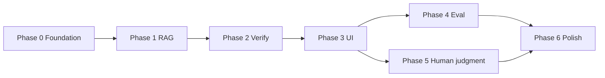

# Implementation Phases — Agentic RAG Prototype

**Project:** NL ChatGPT — verified, justifiable assistant  
**Companion doc:** [ARCHITECTURE.md](./ARCHITECTURE.md)  
**Deadline context:** Fellowship submission — 3 June 2026 (deck + prototype + prompt log)

---

## Phase overview

| Phase | Name | Duration (est.) | Outcome |
|-------|------|-----------------|---------|
| **0** | Foundation & setup | 2–3 days | Repo, env, schemas, hello-graph |
| **1** | Core RAG pipeline | 4–5 days | Plan → retrieve → draft with citations |
| **2** | Verification loop | 4–5 days | LangGraph critique + refine + MiniCheck |
| **3** | Justification & UI | 3–4 days | Streamlit chat + justification panel |
| **4** | Evaluation & calibration | 3–4 days | Ragas/DeepEval + confidence tuning |
| **5** | Human judgment layer | 3–4 days | Per-claim review, fellowship alignment |
| **6** | Polish & deliverables | 3–5 days | Demo, prompt doc, deck hooks |

**Total estimate:** ~3–4 weeks part-time | ~2 weeks full-time

---

## Phase 0 — Foundation & setup

### Goals

- Runnable monorepo with dependencies and config  
- Shared Pydantic schemas and prompt templates  
- Minimal LangGraph that echoes state end-to-end  

### Tasks

- [x] Initialize `pyproject.toml` (Python 3.11+): `langgraph`, `langchain`, `langchain-openai`, `llama-index`, `tavily-python`, `streamlit`, `fastapi`, `pydantic-settings`, `httpx`
- [x] Add `.env.example` and `.gitignore` (secrets, `.venv`, `chroma/`)
- [x] Create `src/models/schemas.py`: `ProcessedQuery`, `RetrievedContext`, `Claim`, `JustificationBundle`
- [x] Create `src/prompts/templates.py` with master system + planner prompts (from ARCHITECTURE §6)
- [x] Stub `src/agents/graph.py` with nodes: `query_processor` → `planner` → `retrieve` (mock) → `draft` (mock) → `justify`
- [x] README: install, run, env vars

### Exit criteria

```bash
python -m src.agents.graph --query "What is Agentic RAG?"
# Returns mock JustificationBundle JSON
```

### Deliverables

- Repo scaffold per ARCHITECTURE §12  
- `docs/ARCHITECTURE.md`, `docs/PHASES.md` (this file)

---

## Phase 1 — Core RAG pipeline

### Goals

- Real web retrieval (Tavily)  
- Grounded draft generation with inline source references  
- Query processor with intent + retrieval query expansion  

### Tasks

- [x] Implement `src/agents/nodes/query_processor.py` (intent, stakes, retrieval queries)
- [x] Implement `src/retrieval/tavily.py` — search, normalize, score, dedupe
- [x] Optional: `src/retrieval/perplexity.py` as fallback if Tavily fails
- [x] Implement `src/agents/nodes/planner.py` — CoT verification plan (structured output)
- [x] Implement `src/agents/nodes/retrieve.py` — attach `RetrievedContext[]` to state
- [x] Implement `src/agents/nodes/draft.py` — LLM call with sources in context; require citation IDs
- [x] Wire LangGraph: `query_processor` → `planner` → `retrieve` → `draft` → justify (`--draft-only` for END at draft)
- [x] Log retrieval snapshot to state for audit

### Exit criteria

- Factual question returns answer with ≥3 clickable source URLs  
- Model refuses or narrows when retrieval returns empty (master prompt rule)

### Tests

- Unit: retrieval normalizer, query decomposition  
- Integration: "Who is the current CEO of X?" (time-sensitive) uses Tavily, not hallucinated name

### Risks

- API rate limits → cache last retrieval per session ID  
- Noisy snippets → trim + relevance filter in retrieve node

---

## Phase 2 — Verification loop (agentic critique)

### Goals

- Self-verification agent compares draft to sources  
- Refine loop (max 2 iterations) removes/fixes unsupported claims  
- Optional MiniCheck for entailment scoring  

### Tasks

- [x] Implement `src/verification/claim_extractor.py` — LLM structured JSON claims
- [x] Implement `src/agents/nodes/verify.py` — verdicts: supported / partial / unsupported / contradicted
- [x] Integrate `src/verification/minicheck.py` (batch claim–passage pairs)
- [x] Implement `src/agents/nodes/refine.py` — patch draft from `VerificationReport`
- [x] Add conditional edge `verify` → `refine` | `justify` in `graph.py`
- [x] Config: `MAX_REFINE_ITERATIONS`, confidence thresholds

### Exit criteria

- Inject a false claim in draft → verifier flags → refine removes or corrects  
- `VerificationReport` stored in graph state and serializable

### Tests

- Golden set: 10 Q&A pairs with known sources; measure unsupported claim rate before/after verify

### Risks

- Verifier hallucinating verdicts → always link verdict to `source_id` + quote span  
- Latency → run MiniCheck only on claims with confidence < 7 from LLM verifier

---

## Phase 3 — Justification generator & Streamlit UI

### Goals

- End-to-end user-facing prototype  
- Streaming answer + justification panel (sources, claims, confidence, checklist)  

### Tasks

- [x] Implement `src/agents/nodes/justify.py` — build `JustificationBundle`
- [x] Implement overall confidence band logic (ARCHITECTURE §10)
- [x] Build `app/streamlit_app.py`:
  - Chat input + history
  - Left: streaming answer
  - Right: sources, claim table (color by confidence), assumptions, gaps, verify checklist
- [x] Optional: `src/api/main.py` with SSE for same events (if separating UI later)
- [x] Handle errors gracefully (retrieval fail, LLM timeout)

### Exit criteria

- Demo flow: user asks → sees plan (optional toggle) → sources → answer → claim-level confidence  
- Low overall confidence shows banner: "Review before using"

### Fellowship artefact

- **Prototype link** for submission (deploy Streamlit Community Cloud or local Loom + GitHub)

### Risks

- Cognitive overload → collapsible justification panel; default show summary only

---

## Phase 4 — Evaluation & confidence calibration

### Goals

- Objective quality metrics on a fixed eval set  
- Tune thresholds so UI flags match actual error rate  

### Tasks

- [x] Create `eval/dataset.jsonl` — 20–30 questions with reference URLs or expected behaviors
- [x] Implement `eval/run_ragas.py` — faithfulness, answer relevancy, context precision
- [x] Implement `eval/run_deepeval.py` — hallucination, contextual recall
- [x] Log per-claim confidence vs verifier verdict agreement
- [x] Adjust `CONFIDENCE_THRESHOLD_*` based on eval (document in README)
- [x] Add CI script: `make eval` (optional, local only)

### Exit criteria

| Metric | Target (prototype) |
|--------|-------------------|
| Ragas faithfulness | ≥ 0.75 |
| Unsupported claims after verify | < 10% on eval set |
| Refine loop trigger rate | 15–40% (not 0% or 90%) |

### Deliverables

- `eval/results/` summary for deck slide "How we measure success"

---

## Phase 5 — Human judgment layer (fellowship alignment)

### Goals

- Product does not replace user judgment — assists evaluation  
- Explicit user actions on claims; session learning hooks  

### Tasks

- [x] UI: per-claim actions — **Trust** / **Unsure** / **Reject** + optional note
- [x] Persist `user_verdicts` in session store (SQLite or JSON)
- [x] Export: answer + justification + user sign-off checkbox for high-stakes mode
- [x] "Stakes" toggle: low skips heavy UI; high requires ≥1 claim review before copy
- [x] Map UI copy to fellowship pillars (quality dimensions, legibility, calibration)

### Exit criteria

- User cannot one-click "copy all" on high-stakes without interacting with ≥1 claim (configurable)
- Session shows which claims user rejected (for demo narrative)

### Deck connection

- Slide: "How users remain in control of judgment"  
- Edge cases: conflicting sources, incomplete reasoning, overconfident draft (ARCHITECTURE §14)

---

## Phase 6 — Polish & fellowship deliverables

### Goals

- Submission-ready artefacts  
- Stable demo + documentation  

### Tasks

- [x] `README.md` — architecture diagram link, setup, demo guide
- [x] `docs/PROMPTS.md` — all prompts organized by use case (fellowship requirement)
- [ ] Record 2-min demo video (optional — see `docs/DEMO.md`)
- [x] Performance: parallel Tavily when multiple retrieval queries
- [x] Security pass: `make check-secrets`, consent copy in UI footer
- [x] Deck outline: `docs/deck/NL_CHATGPT_SLIDES.md` → export as `NL ChatGPT.pdf`
- [x] Research templates + `docs/SUBMISSION.md` checklist
- [ ] Link prototype + survey/interview docs in deck (hyperlinks — fill at export)

### Exit criteria

- [x] 10-slide deck outline (problem, research, solution, flow, metrics, failure modes)
- [x] Prototype run documented (`docs/DEMO.md`; deploy URL TBD)
- [x] Prompt log document (`docs/PROMPTS.md`)

---

## Dependency graph (phases)



**Parallel track:** Phase 4 (eval) can start once Phase 3 has a stable happy path. Phase 5 can overlap with Phase 4.

---

## Milestone checklist (submission)

| Artefact | Phase | Status |
|----------|-------|--------|
| Architecture doc | 0 | ✅ |
| Phases doc | 0 | ✅ |
| Phase 0 scaffold + stub graph | 0 | ✅ |
| Phase 1 RAG (Tavily + LLM draft) | 1 | ✅ |
| Phase 2 verify/refine loop | 2 | ✅ |
| Phase 3 Streamlit + API prototype | 3 | ✅ |
| Phase 4 evaluation suite | 4 | ✅ |
| Phase 5 human judgment layer | 5 | ✅ |
| Eval report (Ragas/DeepEval) | 4 | ⬜ |
| Human judgment UI | 5 | ⬜ |
| 10-slide deck | 6 | ⬜ |
| Prompts by use case | 6 | ⬜ |
| User research (6–8 interviews, survey n≥30) | parallel | ⬜ |

---

## Suggested sprint plan (4 weeks)

| Week | Focus |
|------|--------|
| **W1** | Phase 0 + Phase 1 (RAG works) |
| **W2** | Phase 2 + Phase 3 (full loop + UI) |
| **W3** | Phase 4 + Phase 5 (eval + human review) |
| **W4** | Phase 6 + deck + user research synthesis |

---

## Next action

Start **Phase 0**: scaffold `src/`, `app/`, `pyproject.toml`, and stub LangGraph.

Say **"start Phase 0"** to generate the codebase scaffold in this repo.

---

*Version: 1.0 — May 2026*
