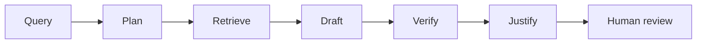

# NL ChatGPT — 10-Slide Deck (copy into Google Slides / Figma)

**Export as:** `NL ChatGPT.pdf` (fellowship naming: `NL PhonePe` format)  
**Rules:** No fellow name on slides; title = key message; font ≥14pt (Slides/PPT).

---

## Slide 1 — Title

**Title:** Verified answers without replacing human judgment

- NL ChatGPT — Agentic RAG prototype
- Product Manager Fellowship — May 2026
- Prototype: [paste Streamlit URL]
- Prompt log: [link to docs/PROMPTS.md]

---

## Slide 2 — Problem

**Title:** Polished AI answers outrun users' ability to judge quality

- Users can't tell if outputs are correct, complete, or safe
- Over-trust → weak work ships; over-reject → tool abandoned
- “Good” is contextual — chat UIs don't help users *evaluate*
- [Link: problem-statement.md]

---

## Slide 3 — Who we serve

**Title:** Knowledge workers using AI for high-stakes tasks

- Segment: professionals using ChatGPT-like tools for research, writing, analysis, career prep
- Unmet need: structured evaluation, not another confidence score
- Stakes vary: email draft (low) vs client report (high)

---

## Slide 4 — User research (placeholder links)

**Title:** Users trust fluency more than evidence

- 6–8 interviews + 2 task observations ([add doc link])
- Survey n≥30 ([add Google Form link])
- Insight 1: users skim answers, rarely open citations
- Insight 2: after one bad mistake, users over-verify manually or quit
- Insight 3: users want “what to check” not “trust score 87%”

---

## Slide 5 — Solution

**Title:** Judgment Studio — plan, cite, verify, then you decide

- Agentic RAG: retrieve → draft with citations → verify claims → refine → package justification
- Per-claim review: Trust / Unsure / Reject
- High-stakes: review gate + sign-off before export
- [Architecture diagram: docs/ARCHITECTURE.md]

---

## Slide 6 — How it works (flow)

**Title:** Six-step pipeline keeps humans in the loop

- Legible: sources, assumptions, gaps, checklist
- Refuse when no evidence

---

## Slide 7 — Demo

**Title:** Live prototype shows claim-level confidence

- Screenshot or GIF of Streamlit UI
- Show: sources panel, claim colors, export blocked until review
- CLI: `python -m src.agents.graph --query "..."`

---

## Slide 8 — Metrics

**Title:** We measure judgment support, not just answer fluency

| Metric | Target |
|--------|--------|
| Faithfulness (Ragas / heuristic) | ≥ 0.75 |
| Unsupported claims post-verify | < 10% |
| Refine trigger rate | 15–40% |
| Claim review completion (high stakes) | Track in product |

- [Link: eval/results/summary.md]

---

## Slide 9 — Failure modes

**Title:** We designed for verifier error and review fatigue

- Verifier wrong → MiniCheck + human Reject
- Checkbox theater → meaningful sign-off copy
- Overload → collapsible panel + stakes tiers
- [Link: docs/FAILURE_MODES.md]

---

## Slide 10 — Close

**Title:** AI should train judgment, not replace it

- Ship: Streamlit prototype + prompt log + eval suite
- Next: production integration, user studies at scale
- Thank you / Q&A

---

*Replace bracketed links with live URLs before export.*
